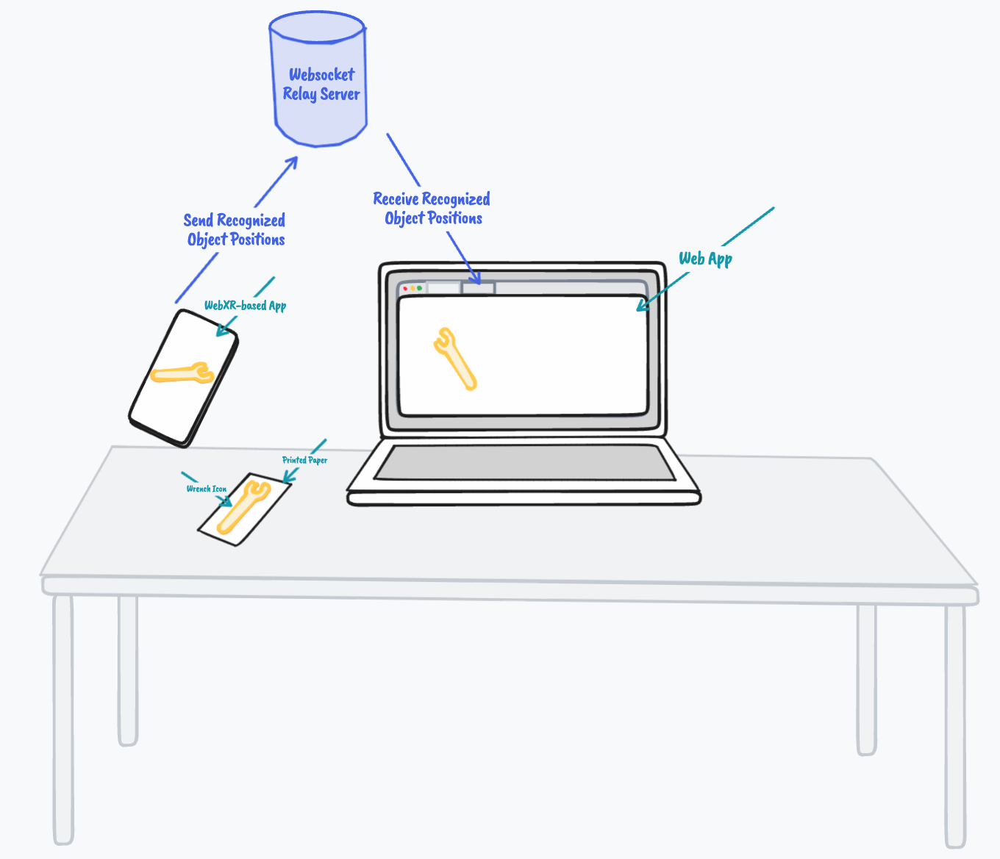

# WebXR Tangible Controllers

### Planned



### Use

 1. Run web server
```bash
git clone
cd webxr-ios-js
yarn
yarn start
open http://localhost:8080/examples/image_detection/wrench-cropped-bordered.png
```
 1. Install [XR Viewer for iOS](https://apps.apple.com/us/app/xr-browser/id1588029989) or use an Android phone that has WebXR support
 2. Find out the IP of your computer
 3. Open http://<your-computers-ip>/examples/image_detection/
 4. Press Go
 5. Point your phone at the wrench displayed on your computer (alernatively, print out wrench-cropped-bordered.png and point your phone at the paper)
 6. You should see a 3D duck model appear on the wrench
 7. That's as far as I got, results weren't promising so I pulled the plug.
